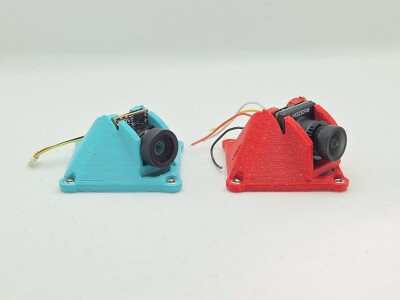
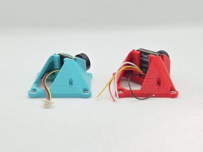
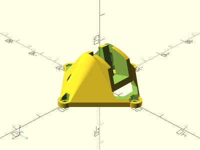
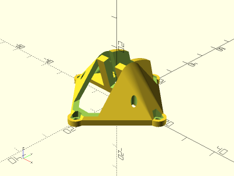
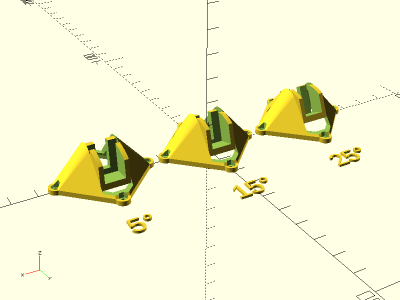
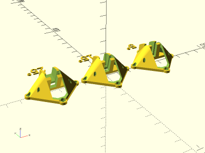

# Parametric Whoop Canopy

<table>
<tr>
<td></td>
<td></td>
</tr>
<tr>
<td></td>
<td></td>
</tr>
<tr>
<td></td>
<td></td>
</tr>
</table>

A parametric whoop canopy. Instances for BETAFPV C03 and HDZero Lux cameras included. Camera angle, Z offset, as well as most dimensions, are parametric. Mounting holes use M1.4-M1.6 nuts. Made with OpenSCAD.

**Base Designs**

* [`canopy.scad`](canopy.scad) - Canopy

**Instances**

* [`betafpv_c03_26x26_canopy.scad`](betafpv_c03_26x26_canopy.scad) - BETAFPV C03 Camera Canopy with 26mm mounting holes (weight 2.6g ASA)
* [`hdzero_lux_26x26_canopy.scad`](hdzero_lux_26x26_canopy.scad) - HDZero Lux Camera Canopy with 26mm mounting holes (weight 2.8g ASA)

**STLs**

* [`betafpv_c03_26x26_canopy.5deg.stl`](stl/betafpv_c03_26x26_canopy.5deg.stl) - BETAFPV C03 Camera Canopy with 26mm mounting holes, 5 degree camera angle, 0mm Z offset
* [`betafpv_c03_26x26_canopy.15deg.stl`](stl/betafpv_c03_26x26_canopy.15deg.stl) - BETAFPV C03 Camera Canopy with 26mm mounting holes, 15 degree camera angle, 2mm Z offset
* [`betafpv_c03_26x26_canopy.25deg.stl`](stl/betafpv_c03_26x26_canopy.25deg.stl) - BETAFPV C03 Camera Canopy with 26mm mounting holes, 25 degree camera angle, 3mm Z offset
* [`hdzero_lux_26x26_canopy.5deg.stl`](stl/hdzero_lux_26x26_canopy.5deg.stl) - HDZero Lux Camera Canopy with 26mm mounting holes, 5 degree camera angle, 0mm Z offset
* [`hdzero_lux_26x26_canopy.15deg.stl`](stl/hdzero_lux_26x26_canopy.15deg.stl) - HDZero Lux Camera Canopy with 26mm mounting holes, 15 degree camera angle, 2mm Z offset
* [`hdzero_lux_26x26_canopy.25deg.stl`](stl/hdzero_lux_26x26_canopy.25deg.stl) - HDZero Lux Camera Canopy with 26mm mounting holes, 25 degree camera angle, 3mm Z offset

**Recommended Print Settings:** ASA / PETG / Hard TPU, 0.20mm layer height, 100% infill. Print with no supports and 2 layer raft to prevent warping, or with supports under camera harness.

## License

